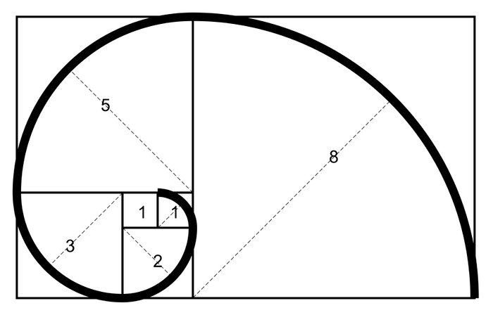
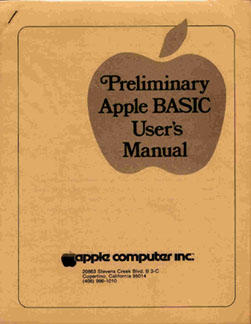
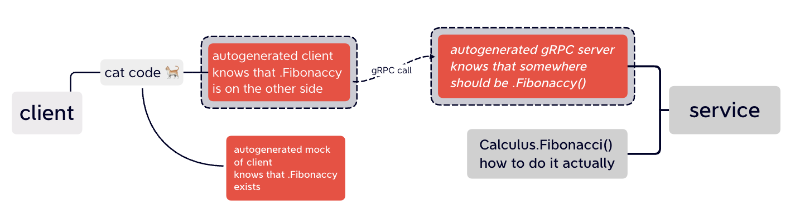

<!-- footer:  -->
<!-- _class: lead -->


# How I Learned to Stop Worrying and Love the Mock

---
<!-- footer:  -->

# Roman Gordeev roman.gordeev@tabby.ai 
## Senior Software Engineer in Test

## https://github.com/woodwo/how-i-learned-to-stop-worrying-and-love-the-mock

---

<!-- paginate: true -->


# What do we have: Stage, microservices, bunch of E2E

---

# What do we want:

- test single service locally easy way
- super-stable tests 99.99999
- test in CI
	- in single contiainer<sup> if it's possible
	- after build, shift-left
- outer calls should be verified too

--- 
<!-- _backgroundColor: #3bffbe -->
<!-- _color: black -->
<!-- _footer:  -->
 
# Use Go and mocks!


---
<!-- _backgroundColor: #000000 -->
<!-- _header: '' -->
<!-- _footer:  -->
 


--- 
 
# WTM: What the Mock?! <br>Mock is ambiguous term!

---

# Questions for mock term:
- Where it begins?
- How we can be sure it is a good mock?
- How can we build it efficiently for a big service?
- How we can control it?

---

<!-- _backgroundColor: #3bffbe -->
<!-- _color: black -->
<!-- _footer:  -->

# All answers are in decomposition of code


---

# Let's start at the very beginning, <br>a very good place to start
And we need an example of code

--- 

# Write function that is not pure
Do the Fibonacci 0, 1, 1, 2, 3, 5, 8, 13, 21, 34, 55, 89, 144...

# But with cats!

---
# All code in [main.go](https://gitlab.com/tabby.ai/testing/tools/how-i-learned-to-stop-worrying-and-love-the-mock/-/blob/main/example/fibonacci/main.go)
```go
...
func fibonacci() func() int {
	b, a := 0, 1
	return func() int {
		f := b
		b, a = a, f+a
		return f
	}
}

func main () {
    f := fibonacci()
    fmt.Println(strings.Repeat("🐈", f()))
    ...
}
```
---

# Purrfect
```bash
main ± > go run main.go

🐈
🐈
🐈🐈
🐈🐈🐈
...
```

---

# Function signature: help me please
```go
func function_name( [parameter list] ) [return_types]
{
   body of the function
}
```
```go
func fibonacci() func() int {
	b, a := 0, 1
	return func() int {
		f := b
		b, a = a, f+a
		return f
	}
}
```
Takes ...? Gives ...?

--- 
<!-- _backgroundColor: #ffa1a1 -->
<!-- _color: black -->
<!-- _footer:  -->
 

# Every piece of code is in one file 

- Name collisions
- No logical grouping
- Broken scroll wheel

see also [What was Coding like 40 years ago?](https://www.youtube.com/watch?v=7r83N3c2kPw)

--- 
<!-- _backgroundColor: #3bffbe -->
<!-- _color: black -->
<!-- _footer:  -->
 
# Decomposition I: <br>Introducing Packages

---

# All function signatures are still well-known
## calculus/calculus.go

```go
package calculus

func Fibonacci() func() int {
	b, a := 0, 1

	return func() int {
		f := b
		b, a = a, f+a

		return f
	}
}
```

---

# For mock - just write function with the same signature
## main.go
```go
package main

import (
	"fmt"
	"package/calculus"
)

func main () {
    f := calculus.Fibonacci()
    fmt.Println(strings.Repeat("🐈", f()))
    ...
}
```  

---
<!-- _backgroundColor: #ffa1a1 -->
<!-- _color: black -->
<!-- _footer:  -->

# Every piece of code is in one repo 

- MR conflicts
- A lot of code owners
- Uneasy CI/CD

Read about [MS repo](https://devblogs.microsoft.com/bharry/the-largest-git-repo-on-the-planet/) - a repo of about 300GB
But how about [monorepos](https://letmegooglethat.com/?q=monorepo+pros+and+cons)?

--- 
<!-- _backgroundColor: #3bffbe -->
<!-- _color: black -->
<!-- _footer:  -->
 
# Decomposition II: <br>Introducing Modules

---

# Main idea of module:
## - add meta to bunch of files<br>- call them a package<br>- profit!
Perl CPAN was conceived in 1993 <br>and has been active online since October 1995


---

# Go modules
- create repo
- clone it locally
- run `go mod init <repo path>`, `go.mod` file has been created
- write code
- push it back

see also: https://docs.gitlab.com/ee/development/go_guide/dependencies.html

---

# So create calculus third-party lib
```
git clone git@github.com:woodwo/calculus_lib.git
cd calculus_lib
cp example/package/calculus.go .
go mod init git@github.com:woodwo/calculus_lib.git
go mod tidy
git add *
git commit -m 'as lib'
git push
```

---

# Now you can import it <i>again</i>
`main.go`
```go
package main

import (
	"fmt"
	calculus "github.com/woodwo/calculus_lib"
)


func main () {
    f := calculus.Fibonacci()
    fmt.Println(strings.Repeat("🐈", f()))
    ...
}
```

---
<!-- _backgroundColor: #ffa1a1 -->
<!-- _color: black -->
<!-- _footer:  -->
 

# Every piece of code is in one service

- Still hard to build
- Hard to deploy
- Hard to deliver changes

Monolithic architecture kinda.

--- 
<!-- _backgroundColor: #3bffbe -->
<!-- _color: black -->
<!-- _footer:  -->
 
# Decomposition III: <br>Introducing microservices

---

# Function is still here - but on remote service.
# That is why we call it RPC - remote procedure call.

---


# But function signature is no more well-known!
We lost them when we did decoupling.
# No more easy mock?

---

<!-- _backgroundColor: #3bffbe -->
<!-- _color: black -->
<!-- _footer:  -->

# There is always some contract between services
## [protobuf 3](https://developers.google.com/protocol-buffers/docs/overview#solve) and OpenAPI v3
# You can find them in service repos, <i>not in Slack</i>

---

# Let's split our example to two services:
one count Fibonacci, another print `next value x 🐈`

- calculus_lib will become Calculus service
- `main.go will` become client

---

# Write .proto for Calculus:

```proto
syntax = "proto3";

package calculus;

option go_package = "calculus/grpc/proto";

service calculus {
    rpc Fibonacci(Empty) returns (Value) {} // single handler
 }

message Empty { // empty parameters
}

message Value { // return int32
    int32 value = 1;
}
```

---

# It looks same like our signature!

---

# Generate Go code from it:
`protoc --go_out=. --go_opt=paths=source_relative --go-grpc_out=. --go-grpc_opt=paths=source_relative,require_unimplemented_servers=false calculus.proto`

## Go devs actually autogenerate a lot of code!

---

# protoc gave us a lot of code for Calculus server
```go
handler := func(ctx context.Context, req interface{}) (interface{}, error) {
	return srv.(CalculusServer).Fib(ctx, req.(*Empty))
}
```
## N.B. and also a code for Calculus client

---

# Start a server, touch it with Evans
# This is a stateful service! like others
- next value will grow
- several clients can be attached

---
<!-- _backgroundColor: #3bffbe -->
<!-- _color: black -->
<!-- _footer:  -->
# This is a very like tabby stage!
- restart it for drop counter
- if someone touch it - your next is bumped

---

# Let's write a client, do a tabby cats<br>We will use autogenerated client

```go
import (
	"github.com/woodwo/calculus/grpc/proto"
    ...
)
...
	client := proto.NewCalculusClient(conn)
```
---

<!-- _backgroundColor: #3bffbe -->
<!-- _color: black -->
<!-- _footer:  -->

# All gRPC Go services use same<sup>*</sup> client for integration

---

# Let's test this client
Some test boundaries can be autogenerated too

---

# Do `go build`, <br>start the client, <br>beware the cat clowder 


---

# Client become a black box
- sometimes you can count cats
- your tests affected by other
- it is working, but you are not really sure
- you need a `./client` to be built
- we unable to test negative scenario

# You also testing Calculus =(

---

# Let's write some test on go
you've told me that on 5'th slide
# NO, better just <i>generate them</i>
## [main_test.go](https://gitlab.com/tabby.ai/testing/tools/calculus_client/-/blob/main/cmd/main_test.go)

---

# This is a still black box
- sometimes you can count cats
- your tests affected by others
- it is working, but you are not really sure
- you need a `./client` to be built - <b>no more</b>
- we unable to test negative scenario

---

# What time is it now?
# It is mock time!

---

# We have a client? Yes
# Generate some MockClient!
``` bash
mockgen client/grpc/proto CalculusClient > mock_proto.go
```

---

# ... and use it 

```go
mockCtl := gomock.NewController(t)
defer mockCtl.Finish()
client := mock_proto.NewMockCalculusClient(mockCtl)

gomock.InOrder(
	client.EXPECT().Fib(...).Return(&proto.Value{Value: 1}, nil).Times(1),
)
```

---

# What is just happened?



---

<!-- _backgroundColor: #3bffbe -->
<!-- _color: black -->
<!-- _footer:  -->
# What is just happened?

Code from our services is untouched.
We replace one autogenerated client by other.
Other client have the same interfaces, he is a mock!

---

# Pros
- we test only Client
- we do not need `./client` to be built
- we do not affected by stage, no fixtures
- we sure that external service was called
- we write small amount of code
- we can test negative scenario

---

# Cons
- we have to keep im mind integration test with real services
- maintenance overhead for mocks

---

<!-- _backgroundColor: #3bffbe -->
<!-- _color: black -->
<!-- _footer:  -->
# Thanks. Go mock.